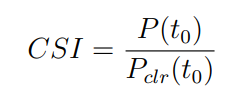
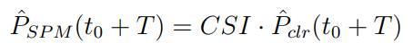

# Smart Persistence Model Implementation

## Goal
The goal of this repository is to provide an easy and standardized **Python** implementation of the **Smart Persistence Model** (SPM) to serve as a benchmark model for **short-term PV power forecasting**. The SPM is one of the most commonly used reference models in short-term PV power forecast research [1]-[4]. My implementation aims to standardize the benchmarking of forecast models in this field as I couldn't find an easy implementation on GitHub so far.

## About the Smart Persistence Model
*The information provided in this section is sourced from [1].*

The Smart Persistence Model assumes that the relative output, measured as the ratio of the actual PV output to the theoretical PV output under clear sky conditions, remains unchanged for the forecast horizon (denoted as T):

where \( CSI \) represents the relative output, or formally named as the clear sky index, \( P \) is the actual PV output, and \( P_clr \) is the theoretical PV output.

At any given time stamp, \( P_clr \) can be estimated by a clear sky model based on sun angles and PV panel orientations [5]:

Where \( I_m \) is the maximum solar irradiance; \( A_e \) is the effective PV panel area, which can be obtained from a least square fit with the real panel output of 12 clear sky days (details can be found in the study by Sun [4]); \( epsilon \) and \( zeta \) are elevation and azimuth angles of the solar PV arrays; \( chi(t) \) and \( xi(t) \) are the zenith and azimuth angle of the sun, which can be estimated for any minute of the year from the empirical functions provided in the textbook by da Rosa [5]. Alternatively, the zenith and azimuth angles can be estimated using the NREL SPA algorithm [6], which can be implemented in Python using the pvlib library [7].

Based on Equation 2, the T-minute-ahead PV output can be estimated by the Smart Persistence Model as:

## References:
1. Yuhao Nie, "Short-term solar forecasting from all-sky images using deep learning," Stanford University Libraries, 2023. Available at: [https://purl.stanford.edu/bm790hj4850](https://purl.stanford.edu/bm790hj4850).
2. Yuhao Nie, Eric Zelikman, Andrea Scott, Quentin Paletta, Adam Brandt, "SkyGPT: Probabilistic ultra-short-term solar forecasting using synthetic sky images from physics-constrained VideoGPT," Advances in Applied Energy, Volume 14, 2024. Available at: [https://doi.org/10.1016/j.adapen.2024.100172](https://doi.org/10.1016/j.adapen.2024.100172).
3. Yuchi Sun, Vignesh Venugopal, Adam R. Brandt, "Short-term solar power forecast with deep learning: Exploring optimal input and output configuration," Solar Energy, Volume 188, 2019. Available at: [https://doi.org/10.1016/j.solener.2019.06.041](https://doi.org/10.1016/j.solener.2019.06.041).
4. Yuchi Sun, "Short-term solar forecast using convolutional neural networks with sky images," Stanford University Libraries, 2019. Available at: [Link to the resource](https://purl.stanford.edu/fm704js1179).
5. Aldo da Rosa. *Fundamentals of Renewable Energy Processes.* 2009. ISBN 9780123746399. doi: [10.1016/B978-0-12-374639-9.X0001-2](https://doi.org/10.1016/B978-0-12-374639-9.X0001-2).
6. Reda, I., & Andreas, A. Solar Position Algorithm for Solar Radiation Applications (Revised). United States: N. p., 2008. doi: [10.2172/15003974](https://doi.org/10.2172/15003974).
7. W. F. Holmgren, C. W. Hansen, & M. A. Mikofski, “pvlib python: a python package for modeling solar energy systems,” Journal of Open Source Software, Jg. 3, Nr. 29, S. 884, 2018. doi: [10.21105/joss.00884](https://doi.org/10.21105/joss.00884).

---

**Disclaimer:** The code provided in this repository may contain errors, and no guarantee is provided for its accuracy or fitness for any particular purpose. If you encounter any issues or have any questions, feel free to contact me.
